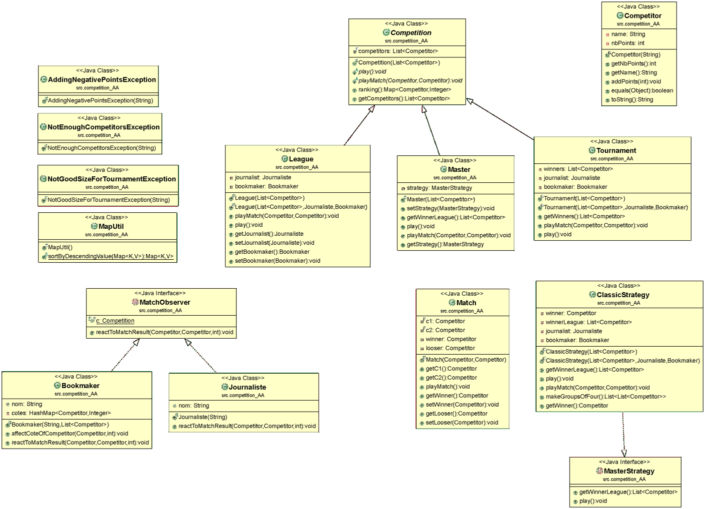

# Projet v1 : Compétitions Sportives

> Binôme : Abir BEZZAZI et Ayoub El KAMILI

# Introduction au projet et ses objectifs

- Travailler en binôme en suivant les consignes et les éxigences du projet (cahier de charge).
- Les objectifs de ce projet sont d'une part mettre en pratique le <span style="color:blue"><ins>processus de TDD</ins></span>, l'utilisation des <span style="color:blue"><ins>Mocks</ins></span> dans les Tests.  
 - Pour la réalisation de ce projet et son accomplissement on s'est basé sur ce qui a été presenté pendant les CM, les idées que notre prof de TD nous à donné en classe mais surtout sur des sites et documents qu'on a trouvé sur Internet. Voici quelques liens des resources qui nous ont aidé :

 - - [Les Mocks](https://www.jmdoudoux.fr/java/dej/chap-objets-mock.htm)  
 - - [Pattern Obsrver](https://www.youtubecomwatchv=_BpmfnqjgzQlist=PLrhzvIcii6GNjpARdnO4ueTUAVR9eMBpc&index=2) (YouTube)
 - - [TDD](https://www.youtube.com/watch?v=6wE6VhF_uNo&ab_channel=DemandeàTonton) (YouTube)

# Rubrique ‘HowTo’ :

## Comment récuperer le dépôt

1. Se placer dans le Terminal.
2. Taper la commande suivante :
   
```
% git clone https://gitlab-etu.fil.univ-lille1.fr/bezzazi/coo-2021-g5-bezzazi-elkamili.git
```


## Comment générer la documentation

1. Placez-vous dans le fichier src/ se trouvant à la racine du projet.
2. Tapez la commande ci-dessous pour la génération de la documentation du dossier competition_AA :
   
```
 % javadoc -d ../docjav -subpackages competition_AA 
```

## Comment compiler les classes 

1. Se placer dans le fichier src.
2. Entrer la commande suivante :


```
 javac competition_AA/* -d ../classes
```
  - Le * dans <strong><em>competition_AA/*</em></strong>  nous permet de compiler tous les fichiers <strong>.java</strong> qui se trouvent dans le dossier competition_AA.
  
  - Cette commande <strong><em>-d ../classes</em></strong> dirige la commande précédente vers un dossier <em>classes</em> dans la racine (vu qu'on a écrit deux points).
  
## Comment générer l'exécutable .jar

1. Il faut avoir compilé toutes les classes du projet.
2. Il faut aussi avoir crée le fichier manifest-ex dont le contenu doit impérativement ressembler à ça : Main-Class: competition_AA.Main.
3. Placez-vous dans le fichier classes (celui crée lors de la compilation des fichiers .java).
4. Maintenant tapez la commande suivante: ```% jar cvfm ../tes2.jar ../manifest-ex competition_AA```
5. Pour l'exécution du fichier jar tapez la commande ci-dessous:

```
% java -jar tes2.jar
```

## UML



## Arboresence du TP

1. Se placer à la racine du projet dans le terminal et taper la commande <em>tree</em>.

```
bezzazi@MacBook-Pro-de-bezzazi coo-2021-g5-bezzazi-elkamili % tree
.
├── README.md
├── manifest-ex
├── src
│   └── competition_AA
│       ├── AddingNegativePointsException.java
│       ├── Bookmaker.java
│       ├── ClassicStrategy.java
│       ├── Competition.java
│       ├── Competitor.java
│       ├── Journaliste.java
│       ├── League.java
│       ├── Main.java
│       ├── MapUtil.java
│       ├── Master.java
│       ├── MasterStrategy.java
│       ├── Match.java
│       ├── MatchObserver.java
│       ├── NotEnoughCompetitorsException.java
│       ├── NotGoodSizeForTournamentException.java
│       └── Tournament.java
├── test
│   ├── CompetitionTest.java
│   ├── CompetitorTest.java
│   ├── LeagueTest.java
│   ├── MasterTest.java
│   ├── MatchTest.java
│   └── TournamentTest.java
└── umlV3.png

3 directories, 25 files

```